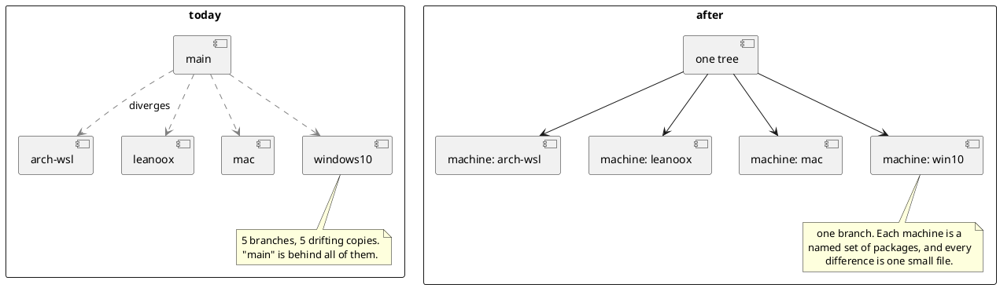
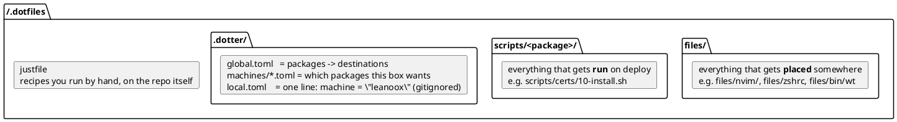
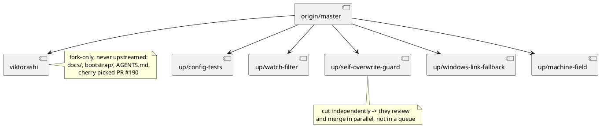

# Dotter fork: design

Goal: a dotfile manager where **configs do not drift across machines** — one tree, every
machine, no per-machine branches — and where an app rewriting its own config in place has
that edit find its way home instead of being lost or clobbered.

Everything here is additive. Existing `global.toml` / `local.toml` must keep working
unchanged.

**Companion files** — read all three before starting work:

| file | contents |
|---|---|
| `AGENTS.md` | project vision, working rules, the upstream maintainer's behaviour |
| `docs/todo.md` | the ordered, gated work items |
| this file | why each decision was made, and what was rejected |

## In one page

Start here. Everything below this section is the detail behind it.

### What is broken today

Your dotfiles live in a bare git repo whose work-tree **is** `$HOME`, so a file's
destination is fixed by where it sits in the repo. The only way to make a machine different
is to give it its own **branch**. You have five. Each one is permanently checked out
somewhere, so every machine quietly drifts from the others.

Measured, not assumed: between `arch-wsl` and `windows10` there are **1478 changed lines and
only ~11 are genuinely OS-specific.** ~98% of the difference is accidental. That is the
disease. Branches are the cause.



### The replacement, in three ideas

1. **A machine is an entity that composes packages.** `nvim`, `zsh`, `certs`, `work-proxy`.
   A machine file lists the packages it wants. Two machines that want the same things cost
   nothing extra. A difference shows up as *one small file*, not a diverged branch.
2. **A file goes to exactly one place per machine.** Different places on different machines,
   never two places at once. This is why the multi-target feature was dropped: you never
   needed it.
3. **Prefer a link over a rendered copy.** A symlink round-trips for free — edit the
   deployed file, the repo file changed, because they are the same file. A rendered template
   does not round-trip, and that is where every hard problem in this project comes from.

### The repo, after the port



Two roots, split by **role**, so nobody can mistake a script for something that forgot its
symlink. Neither root is self-policing on its own, so `dotter doctor` asserts the
convention: everything under `files/` is claimed by some package; nothing under `scripts/`
is; every `scripts/<name>/` is a real package.

### Where the work is

Almost all of it is **config, not code**. The tool changes are small, and each one exists
because a specific thing was measured to be broken:

| what | why it exists |
|---|---|
| **Phase 0a** port the dotfiles | the actual goal. Reconcile the 98% drift *first*, as its own commit, before any dotter config exists |
| **0b** `up/watch-filter` | `dotter watch` infinitely re-deploys; root-caused to globs passed as `filters` instead of `ignores` |
| **0c** `up/self-overwrite-guard` | verified **data loss**: a template inside a whole-directory symlink resolves back onto its own source, and `--force` deletes it |
| **1** `up/windows-link-fallback` | on a corporate Windows box symlinks need Administrator; hard links and junctions do not. Verified on the real box |
| **2** cherry-pick PR #190 | variables in target paths, sitting unreviewed upstream since 2024 |
| **3** `up/machine-field` | the `machine = "..."` pointer + an interactive picker, so a fresh box needs no hand-editing |
| **4** `dotter merge` / `doctor` | the round-trip problem: an app rewrote a *rendered* file and the edit must find its way home |
| **5** branch classification | the one-time migration: tell drift apart from real divergence |

### The one honest constraint

*"NOTHING leaves the repo without a breadcrumb back to the source. Guaranteed. No
edge-cases."* That rule is what decides the hard calls, and it has already overturned one
decision (directories link whole rather than expanding, because expansion silently drops the
files an app writes). Where a rule and a convenience disagree, the rule wins.

### Upstream vs fork

The fork is `viktorashi/dotter`, branch `viktorashi`. **`src/` is currently byte-identical to
upstream.** Every fix that is genuinely upstream's bug gets its own branch cut fresh from
`origin/master` carrying one concern — never a PR from `viktorashi`, which also holds
`docs/`, `bootstrap/` and `AGENTS.md` that upstream must never see.



## The problem, stated precisely

Two regimes:

- **Symlinked file** — target *is* the repo file. App rewrites it, `lazygit` shows it.
  Nothing to build. (SuperCuber, dotter#51: *"in case of a symlink, the filesystem
  already keeps both locations in sync"*.)
- **Templated file** — target is a rendered *copy*. App rewrites it, and the edit is
  stranded: it is not in the repo, and the next deploy wants to overwrite it.

Dotter already **detects** this. `filesystem::compare_template` (`src/filesystem.rs:782`)
compares `.dotter/cache/` against the target and yields `TemplateComparison::Changed`,
at which point deploy refuses:

```
[ERROR] Updating template ".gitconfig" -> "C:\Users\USER/.gitconfig" but target contents were changed. Skipping
```

What is missing is everything after detection. Open, unimplemented:

- dotter#51 "read-only rendered files" — maintainer stalled on it:
  *"the `Changed` comparison is between cache (how I left the file) and target, but
  diff is between rendered and target... :/ my brain hurts"*
- dotter#193 "offer to launch a merge tool when target contents were changed" —
  **zero maintainer response**
- dotter#186 "symlink config to multiple locations" — *"pretty highly requested...
  I'm welcoming PRs on this :)"*. **Not our problem** — see *Multi-target: dropped*.

## Measured: what drift actually looks like

`github.com/viktorashi/dotfiles`, five branches, measured 2026-08. This is the corpus
Phase 0a ports, and it is also the evidence for every claim in the vision statement.

### The current model, and why every symptom follows from it

```sh
# docs/conf.sh — the entire deployment mechanism
export git_dir="$HOME/.cfg/"
conf() { git --git-dir="${git_dir}" --work-tree="$HOME" "$@"; }
```

A bare repo with `--work-tree=$HOME`. **The repo *is* `$HOME`.** Three consequences, all
observed in the corpus:

1. A file's destination is structurally fixed at `$HOME/<path-in-repo>`. There is no
   indirection, so *the only way to express a per-machine difference is a branch*.
2. Anything outside `$HOME` cannot be represented. Hence the hand-written
   `docs/linkables/link_them.sh` — one `sudo ln -s` for `/etc/mc/mc.vim.keymap`.
3. A Windows path that is not a `$HOME` mirror cannot be represented either. Hence
   `docs/startup-scripts/link-nvim.ps1`: **90 lines of PowerShell to junction one
   directory**, `AppData\Local\nvim` → `.config\nvim`, plus a `.bat` twin of the same
   thing. It opens with `#Requires -RunAsAdministrator`, which our own recon proves is
   *not needed* — junctions do not require elevation, only symlinks do (see *Recon log*).

Every one of these is a workaround for the missing indirection, and all three disappear
the moment a target path is a config value.

### Branch topology

| branch | files | ahead of `main` | behind `main` | last commit |
|---|---|---|---|---|
| `main` | 51 | — | — | — |
| `arch-wsl` | 94 | 372 | 18 | 2026-07-29 |
| `leanoox` | 94 | 372 | 18 | 2026-07-29 |
| `mac` | 89 | 198 | 22 | 2026-07-24 |
| `windows10` | 60 | 156 | 19 | 2026-07-01 |

**`main` is not a base.** It is behind every machine branch by 156–372 commits while
carrying 18–22 they never got. It is a stale sixth machine wearing the name of a trunk.

**`arch-wsl` and `leanoox` are byte-identical** — `git diff` between them is empty. Two
branches, two machines, zero divergence. Under composition they are one machine file each,
both selecting the same layers, and the duplication cost is zero.

### The decisive measurement

For every file that differs between `arch-wsl` and `windows10`, classify each changed line
by whether it mentions anything OS-shaped (`windows|wsl|darwin|brew|pacman|apt|scoop|
AppData|USERPROFILE|.exe|/mnt/c|uname|msys|cygwin`):

| | lines |
|---|---|
| changed between the two branches | **1478** |
| of those, OS-flavoured | **29 (2.0%)** |
| of those 29, inside `docs/README.md` | 17 |
| genuinely OS-specific config content | **~11 lines**, in `.zshrc`, `docs/shared.sh`, `keymaps.lua` |

**98% of two years of branch divergence is accidental drift.** Not one line of it was a
decision.

Two representative examples, both classified BOTH-CHANGED by 3-way merge, both with zero
OS content:

- `.config/nvim/lua/plugins/neogit.lua` — `windows10` is missing 5 lines of optional
  plugin dependencies. Nobody chose that.
- `.config/nvim/lua/plugins/mason.lua` — `arch-wsl` added `ruff`, `pyrefly`, `just-lsp`,
  `tree-sitter-cli`, `lemminx`, `xmlformatter`; `windows10` has `black`, `eslint-lsp`,
  `pyright` that `arch-wsl` dropped. Two divergent LSP rosters, arrived at by nobody.

This is *exactly* the failure mode the tagline names, and it is the reason branch
classification (Phase 5) has to be conservative: on this corpus a classifier that
over-reports machine-specific costs almost nothing, because there is almost nothing
machine-specific to find.

### What is genuinely machine-exclusive

Real, and easily expressed as a machine-selected package:

- **windows10 only** — `auto-hotkey/` (incl. a committed `.exe`), `docs/vindovs/`
  (Windows Terminal settings, msys2 profile/conf/nsswitch, WSL vhdx shrink,
  startup-app management), `security-crypto/*.ps1` (Authenticode signing),
  `.bash_profile` (msys), LaTeX/snippet nvim plugins.
- **linux only** — `.config/systemd/user/` units, `/etc/mc/mc.vim.keymap`.

Roughly **15 files of a 94-file tree** are truly machine-bound. Everything else in the
"only on one branch" lists (`.config/opencode/`, `.agents/`, `.codex/`, `.ssh/config`,
`.config/tmux/`, `.gnupg/`, half the nvim plugins) is drift: `windows10`'s branch tip is
four weeks older, so it simply never received them.

### What this corpus decides

- **Composition is sufficient.** ~15 exclusive files and ~11 divergent lines is a machine
  file plus one or two conditionals. Nothing here needs multi-target, confirming
  *Multi-target: dropped*.
- **Phase 1 is load-bearing, and it is the first thing the user will feel.** The junction
  script exists, is hand-written per file, demands admin it does not need, and covers
  exactly one directory. Phase 1 replaces it with a config line and no elevation.
- **Phase 2 (`${var}` in target paths) is what kills the `$HOME`-mirror constraint** —
  it is the indirection whose absence produced all three workarounds above.
- **Templating is barely needed.** ~11 lines across three files. Port with composition
  only (Phase 0a says exactly this) and add templates only where the measurement demands.
- **Phase 5 has a ready-made test set**: the 1478/29 split is ground truth. A classifier
  run over these branches should recover ≈29 candidate lines, not 1478.

## Prior art: nobody shipped this

Fork audit (GitHub API, 2026-08):

- **dotter**: 75 forks, 7 ahead of upstream. Their total divergence is CI/ARM builds
  (orhun), dependabot bumps, feature-flags for scripting/watch (einetuer), a watch
  debounce (Juemuren, +21/-3 in `src/watch.rs`), template recursion (faffeldt).
  **None touch reverse-sync or multi-target.**
- **rotz**: 13 forks, 2 ahead. `bltavares` (+9, his 5 ignored PRs), `kaerum` (+1).
  **None.**

Closest shipped things elsewhere:

| Tool | Reverse-sync on a template | Mechanism |
| --- | --- | --- |
| chezmoi | partial, manual | `chezmoi merge` → 3-way in your editor: Destination (live) / Source (the raw `.tmpl`) / Target (rendered). You hand-type the template edit. |
| chezmoi | lossy | `add --autotemplate` regenerates a template by greedy string→`{{ .var }}` substitution; discards your existing conditionals and comments |
| chezmoi | refuses | `re-add` — silent `continue` on `Attr().Template` |
| dotdrop | refuses | `update -P` prints a `diff -u tmp live \| patch template` one-liner; docs say "not bullet-proof" |
| yadm | none | `yadm alt` overwrites the render |
| rotz | n/a | dodges it — templates the *manifests*, deploys dotfiles as raw symlinks |
| `mermonia/peridot` (Go, 0★) | none | renders to an artifact dir and **symlinks the artifact** — good idea, one-directional |
| `cebarks/dotm` | vaporware | advertises `dotm adopt`; `adopt` appears in README/CHANGELOG/docs and **zero times in `src/`** |

Conclusion: wanted by many, shipped by none, one maintainer publicly gave up.

## Architecture: what we build vs. what we delegate

Unix seams. Dotter's contribution is **merge base + branch classification**. Everything
else is an existing tool.

| Job | Owner |
| --- | --- |
| Which source file → which target(s) on this machine | **dotter** |
| What did I last write there (the merge base) | **dotter** — `.dotter/cache/` already is exactly this |
| Detect that the target drifted | **dotter** — `compare_template` already does this |
| Produce a 3-way conflict | **git** — `git merge-file --diff3` |
| Resolve it structurally | **mergiraf** |
| Remember the resolution | **git rerere** |
| Decide which template branch an edit belongs to | **dotter** (the new part) |
| Show me the result | lazygit / editor |

### mergiraf

<https://mergiraf.org> — Rust, ★414, active (last commit 2026-08-04), tree-sitter based
syntax-aware git merge driver. Supported declarative formats: **TOML, YAML, JSON, INI,
HCL, XML, Java properties, devicetree, go.mod**, plus Lua, Nix, Bash. Falls back to
line-based merging when a file cannot be parsed — which is exactly the desired
degradation for formats with no structure.

**Depend on the binary, never the crate.** It carries ~30 tree-sitter grammars; linking
it in would dwarf dotter's own 4400 lines in build time and binary size.

**It is an optional runtime dependency.** Only needed when a conflict actually occurs.
Without it dotter falls back to plain `git merge-file`.

### rerere

`git rerere` records a conflict resolution and replays it automatically next time. Not
available via libgit2 — verified: `libgit2/include/git2/merge.h` exposes only
`default_driver` (`text`/`binary`/`union`), with **no custom merge driver registration
and no rerere at all**. Reimplementing it inside dotter is out of scope and out of
character.

The cascade `mergiraf → rerere → human` is what git already does natively once both are
registered: the merge driver runs first, rerere then checks for a recorded resolution,
the remainder lands on you. **Nothing to build.**

**Sharing resolutions across machines — verified working.** `rr-cache` lives at
`$GIT_DIR/rr-cache` and is not configurable, but symlinking it works:

```sh
rm -rf .git/rr-cache
ln -s "$DOTFILES/.rr-cache" .git/rr-cache
```

Tested: resolution recorded through the symlink, and replayed automatically on a repeat
of the same conflict.

> **Caveat:** rr-cache stores conflict pre/post images, i.e. *fragments of the
> conflicting files*. Committing it commits config snippets. Fine for dotfiles;
> dangerous if a conflict ever occurs in a file containing a credential.

## The new part: branch classification

Getting a merged *output* back into a `.hbs` requires inverting the render. Handlebars is
not invertible. The trick that avoids needing it:

> **Render every declared machine's variant of the template. Diff the renders against
> each other.** Lines identical across all N renders are generic. Lines that differ are
> machine-specific, and you know exactly which branch produced them.

That yields a classification with **zero template introspection** — no handlebars AST, no
provenance instrumentation.

### The classification *is* a three-way merge (verified)

Comparing renders line-by-line and maintaining a line-range map is more machinery than
needed. The question "is this edit generic or machine-specific?" is already answered
exactly by a 3-way merge we can run with tools we depend on anyway.

For an edit observed on machine `M`, and for each other declared machine `K`:

```
base   = render(M)          # what M looked like before the app touched it == .dotter/cache/
ours   = render(K)          # what K currently renders to
theirs = live file on M     # base + the app's edit
```

- **merges cleanly** → the edited region is identical across M and K → the edit is
  **generic**
- **conflicts** → K diverges from M in that region → the edit is **M-specific**

That is precisely `git merge-file` semantics: a conflict arises iff *ours* also changed
relative to *base* in the same region — which is the definition of "this region is
machine-divergent".

No line-range map, no new parser, no template introspection. `N-1` invocations of a
binary already in the design.

Verified empirically (`git merge-file --diff3`):

| edit on `arch` | result | classification |
| --- | --- | --- |
| `theme = dark` → `light` (identical on both renders) | exit 0, clean | generic ✓ |
| `pkg = pacman` → `yay` (differs: rhel has `dnf`) | exit 1, conflict | machine-specific ✓ |
| adds `font = mono`, not adjacent to a divergent line | exit 0, clean | generic ✓ |

Note the third row: this is exactly the case a provenance lookup **cannot** answer, since
a newly added line has no provenance to look up. Merge handles it because it classifies by
*position relative to divergence*, not by lookup.

### Known failure mode: adjacency

An addition placed **immediately adjacent** to a machine-divergent line produces a false
conflict — the diff hunk swallows both:

```
base(arch)   ...  pkg = pacman
ours(rhel)   ...  pkg = dnf
theirs(live) ...  pkg = pacman
                  font = mono     ← generic addition, but at EOF next to divergent pkg
→ CONFLICT (false "machine-specific")
```

**mergiraf does not rescue this case.** Verified: with `.toml` extensions and both with and
without a `[section]` header, mergiraf 0.18.0 produced the same conflict. It *does*
commutatively merge genuinely independent additions on both sides (verified: two new keys
added to the same `[section]` merged cleanly), but the adjacency shape above defeats it.

This is acceptable because **the failure direction is safe**: it over-reports
machine-specific, which routes to the human. It never silently files a machine-specific
edit into the generic body. Misclassification costs a prompt, not a wrong write.

### Cascade

Whatever conflicts remain go, in order, to: **mergiraf → rerere → human**. This ordering
is what git does natively once both are registered — the merge driver runs first, rerere
then replays any recorded resolution, and the remainder surfaces to you. Nothing to build.

### Rejected alternative: in-band provenance comments

Annotating the rendered output with comments saying which branch each region came from
is **self-defeating**. The apps in scope are exactly the ones that rewrite their own
config, and any app that does deserialize → mutate → serialize with a standard library
(`serde`, Go `encoding/json`, `gopkg.in/yaml`) **drops comments by construction**. The
annotation is destroyed by precisely the event it exists to survive. Strict JSON has no
comments at all. (VSCode is a counterexample — it edits jsonc in place and preserves
comments — but it is the minority.)

### Accepted, but insufficient: a sidecar provenance file

A sidecar recording *"this output came from template T, machine M, template hash H"*
survives app rewrites and is cheap. It makes the merge base bulletproof and distinguishes
*template changed* from *target changed*. Since `.dotter/cache/` already stores the render,
this is roughly "add a template hash", ~5 lines. Worth doing.

It does **not** solve classification. Provenance maps *existing* output lines back to
template nodes. An app that adds a **new** setting produces a line with no provenance to
look up — and that is the common case. Render-diff handles it because it classifies by
*position*, not by lookup.

### Why write-back stays manual in v1

Render-diff is not exact either. It misclassifies when two branches render identical text:

```hbs
{{#if linux}}editor = vim{{else}}editor = vim{{/if}}
```

Identical across variants → classified "generic" → but there is no generic body to write
into. Ambiguous.

Neither mechanism is sound enough to justify automatic write-back into a template. So v1
does not attempt it:

> Merge on the **rendered output** (safe and exact: base = `.dotter/cache/`, ours = live
> target, theirs = fresh render). Then *show* the classification as a **hint** — "this
> edit merges cleanly against every other machine's render → likely generic; this one
> conflicts against `work-rhel` → likely machine-specific" — and open the template
> annotated with it. The human presses the button.

No template inversion, no invertibility risk, roughly a third of the code. Automatic
write-back is deferred (see `docs/todo.md` Phase 5), gated on the hint proving reliable in practice.

### The constraint this requires

Rendering all variants from one machine is only possible if every branching input is
data dotter already has.

> **A content template may branch only on variables whose complete set of possible
> values is declared in a tracked file. It may not branch on live probing
> (`env_var`, `eval "shell cmd"`, filesystem checks).**

This applies to file **contents** only. Target **paths** are a different code path and
may still use env expansion — `${APPDATA:-/nonexistent}` already works today.

A content template that genuinely needs live env opts out of classification and always
routes to manual conflict. Acceptable degradation.

## Composition is the whole model

Earlier drafts swung between a machine table with `inherits`, then `[settings.variants]`
axes branched on with `{{#if}}`, then a multi-target array as the primary mechanism. All
were wrong, for the same reason: they invented a schema for something dotter already
does.

One mechanism answers all three questions:

| question | answered by |
|---|---|
| **Which files exist on this machine?** | packages selected in the machine file |
| **Where does this file go here?** | `[files]` override, or a variable in the target (PR #190) |
| **What is in it?** | variables, app-native `include` directives, templating as last resort |

**`[settings.variants]` is dropped** — it existed only to enumerate branch values for
classification, which is now gated on there being any templates at all. If Phase 0a finds
none, it is never needed. If it does, reintroduce it then, scoped to the residual set.

### Composition: what dotter already does

The chain in `merge_configuration_files`:

```
global.toml packages          (must be DISJOINT — duplicate source key is a hard error,
                               config.rs:363)
  → local.includes[0..n]      (ordered override: package_global.files.extend(included),
                               config.rs:298-300)
    → the local config        (see "Machine selection" below)
      → local `[files]`       (final override: output.files.extend, config.rs:409)
```

A machine is one **tracked** file under `.dotter/machines/<name>.toml`, listing the layers
it composes, the packages it enables, and any overrides:

```toml
# .dotter/machines/desktop.toml          — tracked
includes = [".dotter/layers/arch.toml"]
packages = ["core", "gaming"]

# .dotter/machines/laptop.toml           — tracked
includes = [".dotter/layers/arch.toml"]
packages = ["core"]
```

Verified end-to-end against a scratch `HOME`: both machines pick up the shared `arch`
layer; desktop additionally deploys `gaming`; laptop does not.

Drift needs no new mechanism:

| drift | how |
|---|---|
| desktop gains a file laptop must not have | add a package, enable it in `desktop.toml` |
| several machines share a change | put it in a layer they all include |
| WSL needs interop files native Arch must not | a `wsl.toml` layer, included only by the WSL machine |
| a shared file's *contents* differ | a variable, or an app-native `include` directive |

### Machine selection: the `machine` pointer

**Hostname selection is rejected.** A Windows host and its WSL guest report the same
hostname, so `<hostname>.toml` (`config.rs:159-171`) cannot distinguish them. Setting the
WSL hostname via `/etc/wsl.conf` is circular — that file is itself deployed by dotter, so it
requires the config that requires the hostname.

Instead, `local.toml` becomes a **single generated line**, written by the picker, never by
hand:

```toml
# .dotter/local.toml    — gitignored, generated by `dotter init-machine`
machine = "desktop-wsl"
```

`LocalConfig` gains `machine: Option<String>`, resolved by loading
`.dotter/machines/<name>.toml` as the local config and layering anything in `local.toml`
on top. Machine files may not themselves set `machine` (no chaining).

> **Guard against silent failure.** `packages` must be defaulted for a one-line
> `local.toml` to parse — but then a *malformed* local config stops erroring and silently
> deploys nothing. Rule: **exactly one of `machine` or `packages` must be present**; error
> otherwise. A loud failure must not become a quiet one.

### Why this matters beyond ergonomics

Every file deployed by composition without templating is a **symlink** — the target *is*
the repo file, so an app rewriting its own config lands the change in the repo for free.
Verified: appending to a deployed file changed the source.

Reverse-sync, classification, three-way merge and rerere exist **only** for templated files.
So the doctrine is:

> **layer → app-native include → template.** Stop at the first that works.

Duplicating a 200-line file per machine to avoid a template is not composition, it is drift.
Most config formats grew an include directive (`source`, git `[include]`, ssh `Include`,
tmux `source-file`, nvim `require`, kitty `include`) precisely for this. Templating is the
residual set: single-file formats with no include mechanism that still need intra-file
variation.

**This argument has a hard dependency on symlinks actually being available — see
"Windows linking" below, where it currently fails.**

## Imperative setup: what dotter gives you, and what it does not

Some machine-specific configuration is not a file in a place. Installing a corporate CA
into the system trust store, setting a proxy, enabling a systemd unit, registering a shell
as a login shell — these are *actions*, and they are machine-specific in exactly the same
way a file target is.

### What ships today

Four fixed hook paths (`src/args.rs:38-52`), run from `src/deploy.rs` at 46 / 150 / 176 /
242:

```
.dotter/pre_deploy.sh    .dotter/post_deploy.sh
.dotter/pre_undeploy.sh  .dotter/post_undeploy.sh
```

`src/hooks.rs:10-62`. Properties, read from source:

- The hook is **rendered through handlebars before running** (`perform_template_deploy`,
  `hooks.rs:41-49`), so every variable — `dotter.windows`, `dotter.packages`, machine
  variables — is available *inside the script text*.
- On Windows a `.bat` sibling of a configured `.sh` is preferred (`hooks.rs:16-27`).
- Non-zero exit **aborts the whole deploy** (`hooks.rs:56-59`).
- CWD is the repo root. **Only the hook file itself is copied into the cache** — sibling
  files next to it are not, so `$0`-relative paths break. Reference paths relative to CWD.

What is missing: hooks are **global**. There is no per-package hook, no per-machine hook,
no idempotency, no ordering. The obvious failure mode is a single `post_deploy.sh` growing
into a 300-line `case`/`if` — which is the drift problem again, relocated into shell.

### `scripts/` **is** the hook — it is not an alternative to one

Stated plainly, because the layout hides it: `.dotter/post_deploy.sh` is the *only* thing
dotter runs. It is a **dispatcher**, and `scripts/<package>/*.sh` are the files it invokes.
There is no second mechanism.

The reason it is not simply one `post_deploy.sh` is that dotter's four hooks are **global** —
they have no idea which packages this machine selected. Putting the logic directly in the
hook means a growing `if` per machine, which is the drift problem relocated into shell.
`scripts/<package>/` is the per-package dimension the hooks lack; the dispatcher supplies it
in five lines, using a variable dotter already injects.

### The design: packages already answer "does this apply to this machine?"

`dotter.packages` is injected as a table of *name → enabled* (`handlebars_helpers.rs:318`).
Since the hook is a template, the **package list can be expanded at render time** and the
hook becomes a dispatcher over the packages this machine actually selected:

```sh
# .dotter/post_deploy.sh
#!/bin/sh
set -e
run_dir() {
  [ -d "$1" ] || return 0
  for s in "$1"/*.sh; do [ -f "$s" ] && sh "$s"; done
}
{{#each dotter.packages}}{{#if this}}
run_dir "scripts/{{@key}}"
{{/if}}{{/each}}
```

**Verified working** (2026-08, release binary, scratch `HOME`). With
`packages = ["certs", "proxy"]` and script dirs present for `certs`, `proxy` *and* `nvim`,
dotter rendered exactly two `run_dir` lines and ran only those two. `scripts/nvim/` was
never touched. A script exiting non-zero aborts the deploy with
`run post-deploy hook / subshell returned error`.

So: **imperative machine-specific setup needs zero dotter source changes.** Machine
selection stays in TOML where it belongs; shell only *executes*, it never *decides*. This
is the opposite of the rejected `link.sh` design, where link destinations lived in a shell
table.

Ordering within a package is the filename (`10-`, `20-`). Ordering *between* packages is
`BTreeMap` order, i.e. alphabetical — deterministic, and if that ever matters the packages
were modelled wrong.

### The layout, and why a script can never be mistaken for an unlinked file

The user's current repo demonstrates the hazard precisely: `docs/` holds `cfg-bin/git` (a
wrapper meant to be **on `PATH`**, i.e. linked) directly beside `git-settings.sh` and
`setup-certficates.sh` (meant to be **run once**) and a dead `legacy-shi/`. Nothing in the
tree distinguishes them, so "is this missing a symlink or is it a script?" is unanswerable
without reading each file.

Two roots, each with a *mechanical* consequence rather than a convention:

```
files/<anything>          placed somewhere — claimed by some [pkg.files] entry
scripts/<package>/*.sh    executed on deploy, only if <package> is selected
```

- A file under `files/` that no package claims is **dead** — it is deployed nowhere.
- A script under `scripts/<package>/` where `<package>` is not a real package **never
  runs**, silently.

Both are real failure modes, so neither directory is self-policing. The convention is made
enforceable by one check in `dotter doctor` (Phase 4):

1. every path under `files/` appears as a source key in the merged config;
2. no path under `scripts/` appears as a source key;
3. every `scripts/<name>/` matches a declared package name.

That turns "did I forget to link this?" from a code review question into a command. The
directory names carry no magic — `dotter doctor` is what makes them true, and it is the
reason to prefer this over any naming convention alone.

`files/` is deliberately the same word as dotter's own `[pkg.files]` key: zero new
vocabulary. Note the split is by *role*, not by package, because most packages have files
and no scripts; only `scripts/` is package-indexed, and there it is load-bearing rather
than decorative.

### Idempotency is the script's job — for now

Scripts run on **every** deploy, and `dotter watch` deploys on every source edit. So a
script must be safe to re-run: `update-ca-trust` is, `>> ~/.profile` is not.

Deliberately not built yet: chezmoi-style `run_once_` / `run_onchange_` hashing. The
mechanism is nearly free *inside dotter* — rendered hooks already land in `.dotter/cache/`,
and `filesystem::compare_template` already answers "did the rendered content change" — so
this is a real feature for a later phase, not a shell state-file hack now.

**The tell to watch for:** the moment two or more scripts grow a hand-written `[ -f
~/.some-marker ] && exit 0` guard, build `onchange`. Until then, one documented rule
("scripts must be idempotent") costs nothing.

### The third category: things you run yourself

`files/` is "placed", `scripts/` is "run on deploy". A third kind exists and the current
repo has a pile of it: commands invoked **on demand**, during normal use of the machine.
`docs/` currently holds `backup-remove-and-clone.sh`, `generate-readme.sh`,
`restore-nvim-session.sh`, `tmux-config.sh`, `startup-scripts/configupdatemason.sh`,
`no-exe-wrapper-scripts.sh`, plus a `docs/Makefile` (present on all three branches, one
recipe).

Reading them, most are not a third category at all:

| current file | what it actually is | destination |
|---|---|---|
| `restore-nvim-session.sh` | one line, `exec nvim "+lua …"` | a shell alias — delete the file |
| `tmux-config.sh` | one line, `tmux source-file …` | a shell alias — delete the file |
| `generate-readme.sh` | one `pandoc` line | **already duplicated** as the `generate-readme` recipe in `docs/Makefile` |
| `no-exe-wrapper-scripts.sh` | `echo`s two static 2-line wrappers into `~/.local/bin` | those wrappers are just files → `files/bin/wt`, `files/bin/im` |
| `backup-remove-and-clone.sh` | operates on `$HOME` / the repo | a recipe |
| `configupdatemason.sh` | regenerates `mason.lua` from what is installed | a recipe |

So of six scripts: two are aliases, one is a duplicate of a recipe that already exists, one
should be two plain files, and **two** are genuine. The pile was never a missing feature —
it was a missing place to put things, which is exactly the discoverability failure the
`docs/Makefile` also demonstrates by having been forgotten and re-implemented as a `.sh`.

**Finding with consequences for Phase 0a:** `configupdatemason.sh` *generates*
`.config/nvim/lua/plugins/mason.lua`. The two divergent LSP rosters flagged as
unreconcilable drift are therefore a **regeneration artifact**, not two considered
decisions — whichever machine ran the script last won. That file is not merged by hand; it
is regenerated.

The rule, drawn where it is mechanical rather than taste-based:

- **Runnable from anywhere, needs no repo context** → it is a *file*. `files/bin/foo` with
  target `~/.local/bin/foo`. No new machinery, machine-scoped for free by package
  selection, and works on Windows via MSYS2 `sh`. The user already invented this pattern:
  `docs/cfg-bin/git`.
- **Operates on the dotfiles repo itself** → a recipe in a `justfile` at the repo root.

#### Why `just`, and why it is safe to depend on

`just` is already in use — `.zsh/completions/_just` is tracked on `arch-wsl` and `just-lsp`
is in the mason roster. `make` is present but is the wrong tool for non-build tasks
(tab-sensitivity, everything `.PHONY`, no arguments); the existing four-line `docs/Makefile`
is migrated and deleted. `mise` is installed on this host but appears nowhere in the corpus,
and pulling in a tool-version manager to get a task runner is the larger dependency.

The dependency is **soft by construction**: recipes are by definition never needed to
deploy, so `bootstrap/` still installs only `git` + `dotter`. On a machine without `just`
the fallback is reading one line out of the justfile. Verified here: `just` 1.45.0 supports
`import? "file.just"` (optional import — no error when absent), so per-machine recipes are
possible later without templating the justfile. Not built now; nothing needs it yet.

## Multi-target: dropped

**Superseded by a clarified requirement.** Earlier drafts treated "one source, many
targets" as the founding need, on the strength of the original complaint that destinations
should be declared together rather than scattered.

The clarification that kills it:

> *"I'm not gonna link the same files in multiple places on the same machine. Just in
> different places on different machines."*

Simultaneous multi-target — one source deployed to two locations **at once, on one
machine** — is #186's case (`pwsh` → both `Documents\PowerShell` and
`Documents\WindowsPowerShell`). It is not a requirement here and never was.

What is actually needed is *different destinations on different machines*, which is
**exactly one target per machine**. `FileTarget` already expresses that. No schema change,
no `FileTarget::Many`, no `cache.toml` migration, no #186.

### The co-location objection, resolved

The original complaint stands: with composition, a destination lives in a machine file
rather than beside its source. But that is a **transposition**, not a loss — the same
facts, indexed differently:

| indexed by | easy to answer | hard to answer |
|---|---|---|
| **source** (multi-target array) | "where does `nvim` go everywhere?" | "what is different about `win-work`?" |
| **machine** (composition) | "what is different about `win-work`?" | "where does `nvim` go everywhere?" |

Given the vision is *configs must not drift across machines*, the question that matters is
the second one — **what does this machine diverge on** — and a machine file answers it by
construction: every divergence for that machine is in one place, reviewable in one diff.
The by-machine index is the better fit for the actual goal.

### Deferring is free — verified against the actual code

Two realistic same-machine cases were raised, and they are not fake:

- **VSCode + VSCodium** — same settings, two directories, one machine. `settings.json` has
  **no include directive**, so the app cannot compose it. This is a genuine hole.
- **vim + nvim** — weaker: nvim *does* have an include mechanism, and the idiomatic init is
  `set runtimepath^=~/.vim` + `source ~/.vimrc`. That is rung 2 of the ladder, not a
  multi-target need.

Zero-code workaround for the VSCodium shape: a second source path that is a **repo-internal
symlink** to the first.

```toml
"vscode/User"   = "~/.config/Code/User"
"vscodium/User" = "~/.config/VSCodium/User"    # `vscodium` is a symlink to `vscode` in-repo
```

Git tracks symlinks; dotter links the link; it resolves. Caveat: repo-internal symlinks need
`core.symlinks` and Developer Mode on Windows — the same wall as *Windows linking*, so it is
not free there.

**Why it can wait.** `FileTarget` is an untagged serde enum, so a `Many` variant is purely
additive — every config that parses today still parses. Adding it in six months costs
exactly what it costs now. Measured overlap with the planned branches:

| branch | files | collides with multi-target? |
|---|---|---|
| `up/config-tests` | `tests/` | no |
| `up/windows-link-fallback` | `filesystem.rs`, `deploy.rs:67-84` | **yes** — same file-classification loop in `deploy.rs` |
| `up/self-overwrite-guard` | `actions.rs` | no |
| `up/machine-field` | `config.rs` (`LocalConfig`) | no — different struct from `FileTarget`/`Cache` |

One conflict, in one function, mechanically resolvable. And there is **no shared
`cache.toml` migration** to bundle: multi-target needs one (source → *one* target today),
Windows linking is not expected to. So doing them together saves nothing.

Order matters strategically, not technically: `up/windows-link-fallback` is a bug fix and lands in the
same-day bucket, while multi-target is design-blocked (#186 open since 2024). Stacking a
fast fix behind a slow feature rots both.

**The tell to watch for:** the moment a duplicate source file or a repo-internal symlink is
created *purely to obtain a second target*, write it down. Two or three instances justify
building it. Until then it is one hypothetical.

### Recovering most of the co-location anyway: upstream PR #190

`balthild:master` — *"Expand variables in target paths"*, +106/-13, `src/config.rs` only,
closes #61, **open and unreviewed since 2024-11-06**.

With it, targets can reference variables:

```toml
# global.toml — destination stays next to the source
# NOTE: shell-style ${...}, NOT handlebars {{ ... }} — verified, see Recon log
"nvim"                 = "${config_dir}/nvim"
"vscode/settings.json" = "${config_dir}/Code/User/settings.json"
```

```toml
# .dotter/machines/win-work.toml — one line covers every file above
[variables]
config_dir = "${APPDATA:-/nonexistent}"
```

That collapses N per-file overrides into **one variable per machine**, which is the real
DRY win and most of what co-location was ever worth. See *Cherry-picks* below.

## Windows linking: the fallback that does not exist

**This invalidates the "everything is a symlink" argument on Windows, and it is currently
unaddressed.**

`deploy.rs:67-84`: if `filesystem::symlinks_enabled` returns false, dotter routes **every
file** into `desired_templates` — not just templated ones. All of them become rendered
copies:

```
No permission to create symbolic links.
On Windows, in order to create symbolic links you need to enable Developer Mode.
Proceeding by copying instead of symlinking.
```

Consequences on a Windows box without Developer Mode:

- No file round-trips. An app rewriting its config is a drift event for **100% of files**,
  not the residual templated set.
- The reverse-sync machinery (Phases for `merge` and classification) becomes load-bearing
  for everything, rather than a fallback.
- Corporate machines are exactly where Developer Mode is locked down — i.e. the worst case
  is the work laptop.

### The fix: hard links and junctions

Both are **privilege-free** on Windows, and a hard link shares an inode, so round-trip is
preserved exactly as with a symlink:

| source kind | mechanism | privilege |
|---|---|---|
| file | `CreateHardLink` | none |
| directory | NTFS junction | none |

Rotz already does this (`junction::create` for directories, hard links for files, selected
by `link_type = "hard"`). Dotter has no such path — its only fallback is copying.

Known limits, to be documented rather than hidden:

- Hard links require **same volume**. Repo on `C:` and target on `C:` is the normal case;
  a repo on `D:` targeting `C:` must fall back to copying.
- A hard link is not a symlink: deleting the repo file does not break the target, it just
  decrements the link count. `undeploy` must therefore delete by cache entry, which it
  already does.
- Junctions are directory-only and do not follow across volumes either.

### This is bigger than swapping a syscall — verified

`filesystem::get_file_state` (`filesystem.rs:696`) detects links with `fs::read_link`:

```rust
if let Ok(target) = fs::read_link(path) {
    return Ok(FileState::SymbolicLink(target));
}
```

**A hard link is not a symlink**, so `read_link` fails on one. The target then reads as
`FileState::File(contents)`, and `compare_symlink` (`filesystem.rs:737`) falls through to
its catch-all arm:

```rust
_ => SymlinkComparison::TargetNotSymlink   // "target already exists and isn't a symlink"
```

So dotter would treat **its own hard link** as a foreign file and refuse to touch it. Every
deploy after the first would skip, and `--force` would delete and recreate.

The work therefore includes:

1. A new `FileState` variant (or a `SymlinkComparison` arm) for "target is the same file as
   source".
2. **Same-file detection**, which is platform-split: `st_dev`/`st_ino` via
   `std::os::unix::fs::MetadataExt` on unix; `dwVolumeSerialNumber` + `nFileIndex{High,Low}`
   from `GetFileInformationByHandle` on Windows.
3. `compare_symlink` extended to accept it as `Identical`.
4. Junction detection for directories — a junction *is* a reparse point, so `read_link` may
   succeed on it; verify rather than assume.

Revised size: **~150-200 lines** across `filesystem.rs` and `deploy.rs`, not a small patch.
Still self-contained, still a bug fix, but not an afternoon.

### Cache impact: none expected

`Cache { symlinks, templates }` maps source → target. Undeploying a hard link is the same
operation as undeploying a symlink — delete the target — so no format change is expected.
Confirm this before writing the migration-free assumption into the PR.

### Ordering

This lands **before** any reverse-sync work. If Windows can link, the residual templated set
stays small and Phases 4/5 stay optional. If it cannot, they become mandatory — so the
link fix must be attempted first, or the whole cost estimate downstream is wrong.

## Bootstrap

Bare-system seamlessness is a hard requirement: a fresh Arch install has neither `git`
nor `mergiraf`.

### What is already available

- **`curl` is guaranteed on bare Arch** — verified against the Arch package API:
  `base` depends on `pacman`, and `pacman` hard-depends on `curl` (the binary package,
  not just `libcurl`). So `curl ... | sh` is a safe entry point.
- **`git` is NOT** — verified: absent from `base`'s dependency list.

### Prebuilt binaries make this mostly trivial

Both dotter and mergiraf ship static release binaries:

| | targets | download | on disk |
| --- | --- | --- | --- |
| dotter | linux-x64-musl, linux-arm64-musl, macos-arm64, windows-x64-msvc | 3–5 MB | 3–5 MB |
| mergiraf | linux x64/arm64 gnu+musl, macos x64/arm64, windows x64 | 6.4–7.1 MB | **71 MB** |

> The mergiraf tarball is ~6.7 MB but **extracts to 71 MB** (measured, v0.18.0
> x86_64-unknown-linux-gnu) — ~30 bundled tree-sitter grammars. That is 15× dotter's own
> binary, and is the concrete reason it stays an *optional* fetch with `--no-mergiraf`,
> and the reason it is depended on as a **binary rather than a crate**.

So **mergiraf is fetched exactly like dotter's own binary** — no package manager, works on
a bare system. It is also packaged in arch `extra`, homebrew, chocolatey, nixpkgs, alpine,
opensuse TW, macports, gentoo, guix and openbsd, but **not** in debian/ubuntu/fedora —
which is why direct binary download is the reliable path rather than PM delegation.
Prefer the system package when present (it is shared and already on disk); fall back to
the tarball.

### The one genuine system dependency: git

There is no portable static git. The installer therefore needs a narrow `ensure_git` step
shelling out to the native package manager — `pacman` / `apt` / `dnf` / `zypper` / `apk` /
`brew` / `winget`. One package, named literally `git` in every one of them: ~15 lines of
`case`. Needs root; use `sudo` when not already root, and fail loudly with the exact
command when neither is possible.

This is **not** the package-manager-abstraction tarpit rejected below — that concerns
installing the user's arbitrary application list.

### Installer flow

Implemented: [`bootstrap/install.sh`](../bootstrap/install.sh) (POSIX sh — verified
against `dash` and `bash`) and [`bootstrap/install.ps1`](../bootstrap/install.ps1)
(PowerShell 5.1+, ships with Win10/11).

```
detect os/arch
  → ensure git          (native PM — the ONLY package-manager use)
  → install dotter      (static binary download)
  → install mergiraf    (system package first, binary download second,
                         cargo third, skip fourth — never fatal)
  → git clone <repo>
  → dotter init-machine (fzf-style picker, below)
  → dotter setup-git    (rerere + merge driver + .gitattributes)
  → dotter deploy
```

**The entry point is self-proving:** if you can run `curl … | sh`, you have curl and a
shell. Nothing else is assumed.

Target UX:

```sh
curl -fsSL <host>/install.sh | sh -s viktorashi           # → github.com/viktorashi/dotfiles
curl -fsSL <host>/install.sh | sh -s viktorashi/my-config
curl -fsSL <host>/install.sh | sh -s git@host:me/dots.git
```

```powershell
& ([scriptblock]::Create((irm <host>/install.ps1))) viktorashi
```

Verified end-to-end on Ubuntu 26.04 x86_64: platform detection, asset-name mapping,
remote resolution for all four argument shapes, real download of `dotter` 0.13.5 and
`mergiraf` 0.18.0 into a sandbox prefix, and the graceful-degradation path when the
mergiraf download fails.

#### Codeberg is unreliable; plan for it

mergiraf's only binary source is codeberg, and its release downloads fail often —
observed `HTTP/2 stream CANCEL (err 8)` and truncated HTTP/1.1 bodies on repeated
attempts within minutes. There is **no GitHub release mirror** (`qundao/mirror-mergiraf`
mirrors source only, no release assets).

Mitigations, in the script:

1. **System package first** — arch `extra`, alpine, homebrew, opensuse, nixpkgs, gentoo,
   chocolatey. Shared, updated, and avoids codeberg entirely.
2. `--retry 5 --retry-delay 2 --retry-all-errors -C -` (resume, not restart). Verified:
   the download that failed three times in a row succeeded with these flags.
3. `cargo install mergiraf` if cargo is present.
4. Warn and continue. mergiraf is optional by design.

Not in debian/ubuntu/fedora/scoop; **is** in chocolatey (verified).

### Why two scripts and not one

Two separate questions hide here, and they have different answers.

#### Can one *command* work on both? No — and this is provable

The command has three parts: **fetcher**, **transport**, **interpreter**. Unification fails
on two of the three.

| | bare Linux | bare Windows 10+ |
| --- | --- | --- |
| interpreters | `sh` | `cmd`, `powershell` |
| fetchers | `curl` / `wget` | `curl.exe`, `Invoke-WebRequest` |

**The interpreter intersection is empty.** There is no name that means "execute this
script" on both a bare Linux and a bare Windows box. Since the interpreter is the thing
after the pipe, and the pipe is typed by the user, no single copy-pasteable string exists.

The fetcher does not save it either: Windows 10 1803+ does ship `curl.exe`, but in
PowerShell 5.1 `curl` is an **alias for `Invoke-WebRequest`**, which rejects `-fsSL`. You
must write `curl.exe` — which does not exist on Linux.

**A polyglot script file does not help.** Even a file that is simultaneously valid `sh` and
valid PowerShell still has to be *invoked*, and the invocation (`| sh` vs `| iex`, or
`sh f` vs `./f`) is the part that differs. The polyglot solves the half of the problem that
was never the problem.

#### Can one *URL* work on both? Yes

This is the real ask — "I shouldn't have to know which command to run" is mostly "I
shouldn't have to find a different link". UA routing handles it, because the clients are
trivially distinguishable:

```
curl        →  curl/8.18.0
PowerShell  →  Mozilla/5.0 (Windows NT 10.0; ...) WindowsPowerShell/5.1.x
PowerShell7 →  Mozilla/5.0 (Windows NT 10.0; ...) PowerShell/7.4.x
```

Implemented in [`bootstrap/router.js`](../bootstrap/router.js) — a Cloudflare Worker, with
an nginx `map` equivalent in the trailing comment. An explicit `.sh`/`.ps1` suffix always
overrides the sniff, so the scripts stay directly addressable for CI and for anyone who
distrusts UA sniffing. Routing verified against 8 real user-agent strings, including both
PowerShell generations, `Microsoft-CryptoAPI`, empty UA, and explicit-suffix override.

Result — same URL, and the commands differ only in the unavoidable wrapper:

```sh
curl -fsSL https://dott.er/i | sh -s viktorashi     # Linux / macOS
```

```powershell
irm https://dott.er/i | iex                          # Windows
```

#### Where the remaining difference actually goes: the docs page

The user should never *see* both. Detect the OS in JavaScript on the install page and
render only the relevant snippet — which is what bun, deno and rustup all do. Then the
experience is genuinely "copy the one command on the page", even though two exist.

Nobody ships a polyglot installer: bun uses `curl -fsSL https://bun.com/install` **and**
`powershell -c "irm bun.sh/install.ps1 | iex"`; rustup uses `sh.rustup.rs` plus a separate
`rustup-init.exe`; starship, deno, uv and homebrew all have two entry points. That is
strong evidence the second file is not the part worth optimising away.

Answers "on a brand-new machine, which config am I?" without hand-editing anything.

1. **Probe** OS and distro — `/etc/os-release` `ID`/`VERSION_ID` on Linux, `sw_vers` on
   macOS, build number on Windows. Hostname is *not* used for selection (it collides
   between a Windows host and its WSL guest); it is only a ranking hint.
2. **List** `.dotter/machines/*.toml` — the tracked machine entities.
3. **Rank** by similarity to the probe, preselecting the best match.
4. **Present** one fzf-style filter-as-you-type list:

```
? which machine is this?  (type to filter)
> desktop         core, gaming        ← best match (linux/arch)
  laptop          core
  desktop-wsl     core, wsl-interop
  win-work        core, windows
  ──────────────
  (create a new machine)
```

5. **Write one generated line** to gitignored `.dotter/local.toml`:

```toml
machine = "desktop"
```

   Nothing is hand-written, and tracked config is untouched — a new machine needs no commit
   unless it is genuinely a *new* machine.
6. **"create a new machine"** writes `.dotter/machines/<name>.toml` too — a tracked change,
   and the correct moment for one, because a new entity now exists. Offer to seed it from
   an existing machine's `includes`/`packages`.

**Implementation: `inquire`.** Its default features are
`["macros", "crossterm", "one-liners", "fuzzy"]` and it requires `crossterm ^0.29.0` —
which dotter **already pins at 0.29.0**. So `inquire = "0.9"` gives fuzzy filtering while
reusing the existing terminal backend, with no feature fiddling and no second terminal
stack. `dialoguer` was rejected: it hard-depends on `console`, an entire parallel
terminal library.

### `dotter doctor`

Precedent: `chezmoi doctor` ("Check for potential problems"). No dotter issue requests it,
so the design space is uncontested.

Reports: git version, mergiraf presence and version, `rerere.enabled`, merge driver
registered, `merge.conflictStyle`, detected machine, cache validity.

**mergiraf is an optional dependency, but a loud one.** Dotter degrades to plain
`git merge-file` without it. It is advertised in three places: `doctor`, the post-install
summary, and — most importantly — at the moment of pain, when `TemplateComparison::Changed`
fires and mergiraf is absent, printing the exact install command for the detected OS.

If upstream later wants it first-class, that is the maintainer's call to make once the
value is demonstrated.

### Explicitly out of scope

- **Package-manager abstraction for arbitrary applications** (scoop/yay/brew/cargo
  install lists). Known tarpit, and dotter already has the right extension point:
  `pre_deploy` hooks. "Install my packages" is a user hook script.
- **Reimplementing rerere or a merge driver inside dotter.**

## Git setup

libgit2 cannot do this, so shell out to real git (`std::process::Command`; no `git2`
dependency needed):

```
dotter deploy   → notices merge.mergiraf.driver / rerere.enabled unset
                → "run `dotter setup-git`"

dotter setup-git → git config rerere.enabled true
                 → git config merge.conflictStyle diff3
                 → git config merge.mergiraf.driver '...'
                 → writes `* merge=mergiraf` to .gitattributes
                 → warns if the mergiraf binary is not on PATH
```

Fresh system → `dotter deploy` → one prompt → configured.

## Recon log — assumptions tested against a running binary

Everything below was executed, not reasoned about. Date: 2026-08. Binary: dotter 0.13.5.

### Confirmed

| claim | result |
|---|---|
| **A hard link is not recognised as dotter's own link** | **Confirmed.** Deployed a symlink, replaced the target with a hard link to the same source (verified same inode `4132`), redeployed → `[ERROR] Updating symlink ... but target already exists and isn't a symlink. Skipping.` Phase 1's central finding is real. |
| **PR #190 merges cleanly onto current `origin/master`** | **Confirmed.** `git merge-tree` reports no conflicts; built and ran it. |
| **PR #190 does what the plan needs** | **Confirmed.** One `config_dir` variable in a machine file retargeted *both* managed files. |
| **`inquire` reuses dotter's `crossterm`** | **Confirmed.** `cargo tree -i crossterm` shows a single `crossterm v0.29.0` shared by `dotter` and `inquire`. Adds only 5 crates: `inquire`, `dyn-clone`, `fuzzy-matcher`, `thread_local`, `unicode-width`. No `console`, no `termion`. `cargo check` passes. |
| **Duplicate source key across packages is a hard error** | **Confirmed.** Deploy fails at config merge. |
| **Machine-file variables override globals and reach templates** | **Confirmed.** `distro` overridden in the machine file rendered as `arch`; the `{{ }}` file was auto-detected as a template and deployed as a regular file, not a symlink. |
| **mergiraf-as-registered-git-driver resolves what plain git cannot** | **Confirmed.** Same 3-way merge: plain git → 1 conflict marker; with `merge.mergiraf.driver` + `.gitattributes` → 0 markers, both keys merged. The delegation architecture works. |

### Corrections forced by recon

**1. PR #190 uses `${var}`, not `{{ var }}`.** It calls
`shellexpand::env_with_context_no_errors`, so the syntax is shell-style. An earlier example
in this document used handlebars syntax and was wrong — verified that `{{ config_dir }}` is
taken **literally** and creates a directory of that name. Corrected in *Recovering most of
the co-location*.

Precedence, measured:

| form | resolves to |
|---|---|
| `${defined}` where `defined` is a config variable | the config variable |
| `${SHADOWED}` defined **both** as config variable and env var | **config wins** |
| `${MY_ENV_VAR}` not a config variable | the environment |
| `${MISSING:-fellback}` | `fellback` |
| `${undefined_anywhere}` — neither | **hard error**: `error looking key 'undefined_anywhere' up: environment variable not found` |

The last row is the same failure class as the expansion-before-`if` bug: a name that is
absent on this platform aborts config loading. **Every env var in a target must carry a
`:-fallback`.**

**2. The Juemuren debounce does NOT cherry-pick.** `git cherry-pick` conflicts in
`src/watch.rs`: the fork is based on a dotter that used `TaggedFilterer`, while upstream has
since migrated to `GlobsetFilterer` (watchexec 8). The conflict is entirely in the filter
construction, not the debounce.

The debounce logic itself is **12 lines** and transplants by hand:

```rust
let last_deploy = Arc::new(Mutex::new(Instant::now() - Duration::from_secs(10)));
let debounce_duration = Duration::from_millis(500);
// ...inside on_action, before deploying:
let mut last = last_deploy.lock().unwrap();
let now = Instant::now();
if now.duration_since(*last) < debounce_duration { return action; }
*last = now;
drop(last);
```

**Re-implement, do not cherry-pick.**

**3. That commit also contained glob fixes that may still be live bugs upstream.** Juemuren
changed `{}/` → `{}/**`, `.git/` → `.git/**`, and added
`.replace('\\', "/")` for Windows paths. Current `src/watch.rs` still has:

```rust
(format!("!{}/", opt.cache_directory.display()), None),
("!.git/".to_string(), None),
```

On Windows `cache_directory.display()` yields `.dotter\cache`, which cannot match a glob
written with `/`. **Hypothesis (since DISPROVEN — see the Windows session below): the watch filter fails to
exclude the cache on Windows specifically.** It fails on Linux too; the cause is not path
separators but the `filters`-vs-`ignores` argument mix-up. If true, the fix is smaller *and* more
correct than a debounce, and makes a better PR.

### New finding: target collisions are not caught at config time

Two packages may declare **different sources with the same target**. This is *not* a config
error — it surfaces at deploy time, non-deterministically ordered:

```
[ERROR] Creating symlink "src/f2" -> "~/same" but target already exists
        and doesn't point at source. Skipping.
```

First writer wins (BTreeMap order, i.e. alphabetical by package), second is skipped. Since
composition is now the whole model, and composition means combining packages, **this is the
model's main footgun.** A `validate`/`doctor` check for duplicate targets would be cheap and
genuinely useful — note it as a candidate, since the golden test corpus (Phase 0b) can
assert it.

### Windows session — all verified on a real box (WSL interop)

Host: Windows 11 build 26100, **not administrator**, **Developer Mode OFF** — i.e. exactly
the corporate worst case the plan targets. Reached from WSL2 via `powershell.exe`. Windows
has its own Rust toolchain (cargo 1.97.1), so probes and dotter itself were built natively.

**Link capability, measured:**

| operation | result |
|---|---|
| `New-Item -ItemType SymbolicLink` (file) | **FAIL** — "Administrator privilege required for this operation." |
| `New-Item -ItemType SymbolicLink` (directory) | **FAIL** — same |
| `New-Item -ItemType HardLink` | **OK** |
| `New-Item -ItemType Junction` | **OK** |

Hard links and junctions are privilege-free on a locked-down box. Phase 1 is justified by
measurement, not inference.

**Real dotter, built and run on that box:**

```
[WARN] No permission to create symbolic links.
       Proceeding by copying instead of symlinking.
[INFO] [+] template "src/file.txt" -> "C:\Users\istan/deployed.txt"
```

A **plain, non-templated file** was deployed as a "template" (a copy). Confirms
`deploy.rs:84` empirically.

**The decisive probe** (Rust, built natively on Windows, mirroring
`filesystem::get_file_state` and `filesystem::real_path`):

```
read_link(junction)  = Ok("C:\...\Temp\dotterprobe\srcdir")
real_path(srcdir)    = Ok("C:\...\Temp\dotterprobe\srcdir")
EQUAL? true  ->  compare_symlink would return Identical

read_link(hardlink)  = Err(Os { code: 4390, "The file or directory is not a reparse point." })
is_same_file(src, hardlink) = Ok(true)
is_same_file(srcdir, junction) = Ok(true)
```

**This splits Phase 1 into two very different halves:**

1. **Directories are nearly free.** A junction *is* a reparse point, so `fs::read_link`
   succeeds on it and returns exactly what `real_path(source)` returns. Dotter's existing
   `compare_symlink` would already call it `Identical`. Directories need only *creation*
   plus bypassing the `symlinks_enabled` gate — **no comparison changes at all.**
2. **Files need real work.** `read_link` fails on a hard link (OS error 4390), so
   `get_file_state` reports `File(..)` and `compare_symlink` falls to `TargetNotSymlink`.
   A same-file check must be added.

**Use the `same-file` crate, not std.** `std::os::windows::fs::MetadataExt::file_index()`
and `volume_serial_number()` are **unstable** (`windows_by_handle`, rust-lang#63010) — they
fail to compile on stable. `same-file` (BurntSushi, used by ripgrep) is stable, tiny, and
returned correct answers for hard links, junctions, and unrelated files.

### #196 watch loop — root cause found in the filter, fix not fully established

**Reproduced on both platforms.** Touching a single file inside `.dotter/cache` produced 33
deploys on Windows and 132 on Linux. It is not Windows-specific, which kills the earlier
backslash hypothesis recorded above.

**Root cause of the filter being inert — certain.** `watchexec-filterer-globset` 8.0.0:

```rust
pub async fn new(
    origin, filters, ignores, whitelist, ignore_files, extensions
) -> Result<Self, Error>
```

`src/watch.rs` passes the `!`-prefixed globs as **`filters`** (arg 2) and leaves `ignores`
(arg 3) empty. Both lists are fed to a `GitignoreBuilder`, where a leading `!` is a
*negation* and registers as a whitelist, not an ignore. Then at `lib.rs:176`:

```rust
if self.filters.num_ignores() > 0 { /* run the filters */ }
```

With only negated lines, `num_ignores()` is **0**, so the whole filter block is skipped and
**nothing is ever excluded.**

Moving the globs to `ignores` and dropping the `!` demonstrably worked: `.dotter/cache`,
`.dotter/cache/src/tmpl.conf` and `.dotter/cache.toml` disappeared from the traced
changed-file set.

**Not established: whether that alone fixes #196.** After the change, some runs still
looped. Three separate test-methodology flaws were found and corrected mid-investigation,
and the results did not stabilise before the session ended. Treat the filter bug as proven
and the end-to-end fix as **open**.

> **Test methodology warnings — all three of these produced false conclusions here:**
> 1. The **deploy target must be outside the watched tree.** Deploying into `./home` makes
>    every deploy retrigger the watcher. This is inherent, not a bug.
> 2. The **log file must be outside the watched tree.** Redirecting `watch -v` output into
>    the repo does the same thing.
> 3. **Verbosity changes the outcome.** `-v` and `-vvv` gave different deploy counts on
>    otherwise identical runs, suggesting a timing or event-queue interaction. Investigate
>    this before trusting any measurement.

**Consequence for the plan:** the Phase 0b probe PR is *better* than a debounce — it is a
real, cross-platform, root-caused bug in a currently-inert feature — but it is **not yet a
finished patch**. Do not open it until a clean reproduction passes: zero deploys with no
change, exactly one deploy per real source edit, target and logs both outside the tree.

### Still unverifiable here

No Windows machine and no container runtime on this host:

- whether `fs::read_link` succeeds on an NTFS junction
- whether hard links and junctions are truly privilege-free in practice
- the Windows glob hypothesis above
- `install.ps1` is unlinted (no `pwsh`)
- the `pacman`/`apt`/`dnf` branches of `install.sh` are unexercised

These need a real Windows box or a CI runner. **Do not write them up as verified.**

### `bootstrap/install.sh` package-manager dispatch — verified in containers

Docker, 2026-08. Dispatch order `pacman → apt-get → dnf → zypper → apk` selects correctly
on every image tested:

| image | branch taken |
|---|---|
| `archlinux:base` | `pacman` |
| `debian:stable-slim` | `apt-get` |
| `fedora:latest` | `dnf` |
| `alpine:latest` | `apk` |
| `opensuse/tumbleweed` | `zypper` |

Full `install git` executed end-to-end on **debian** (git 2.47.3) and **alpine**
(git 2.54.0).

**Arch and Fedora could not complete the install here, and it is not a script defect.**
This host sits behind a TLS-inspecting corporate proxy (`STRATEC-Chain.pem` in
`/usr/local/share/ca-certificates/`), and both `pacman` and `dnf` reject the intercepted
mirror with *"self-signed certificate in certificate chain (19)"*. Mounting the corporate
root into the container trust store and running `update-ca-trust` did **not** fix it, so
the interception is deeper than the CA bundle. Debian and Alpine were unaffected — their
mirrors are evidently not intercepted.

Worth carrying into the bootstrap design rather than filing away: a corporate TLS proxy
breaks `curl | sh` and every native package install *before* dotter is ever reached. The
user's own dotfiles already contain `docs/startup-scripts/setup-certficates.sh`, which
confirms this is a lived problem on their machines, not a container artifact. `install.sh`
should fail with a message naming the CA, not with a raw curl error.

## Cherry-picks from forks and open PRs

Audited via the GitHub API, 2026-08. Of dotter's **75 forks, 7 are ahead of upstream**; of
rotz's 13, 2 are. Sizes and touched files are measured, not estimated.

### Take

| what | source | size | why |
|---|---|---|---|
| **Watch debounce** | `Juemuren/dotter` — *"Add debounce to prevent infinite loops when watch"* | **+21/-3**, `src/watch.rs` | Closes open issue **#196** (watch + post-deploy hook infinitely recurses). Not our code, near-zero risk. Doubles as the probe PR that measures the maintainer's response time. |
| **Variables in target paths** | upstream PR **#190** (`balthild:master`), open since 2024-11-06, zero reviews | **+106/-13**, `src/config.rs` | Closes #61. Collapses N per-file destination overrides into one variable per machine — recovers most of the co-location the multi-target array was going to provide. Cherry-pick into the fork; do **not** re-open it upstream, that duplicates a PR already rotting. |
| **Recursing for template targets** | `faffeldt/dotter` — *"Allow recursing for template target"* | **+43/-0**, `src/config.rs` | Templated directories currently cannot recurse the way symlinked ones do. Only matters if Phase 0a finds a non-zero residual templated set. |

### Watch, do not take yet

| what | source | size | note |
|---|---|---|---|
| `copy` deployment type with checksum caching | PR **#214** (JP-Ellis), 2026-04 | +1205/-10, 7 files | Overlaps the Windows-linking work: both concern what to do when a symlink is impossible. Hard links are the better answer (round-trip preserved), but the checksum-cache machinery here may be reusable. Read before writing Phase 1. |
| Elevate permissions on directory access | PR **#215** (archnode), 2026-05 | +822/-86, 5 files | Relevant to `/etc` targets with `owner = "root"`. Large; wait and see if it lands upstream. |
| Recursive off by default for symbolic folders | PR **#206** (Faria22), 2025-12 | +59/-2, `src/config.rs` | Behaviour change — would alter deploy semantics under us. Track it. |
| `exclude` function | PR **#216** (haojunyu), 2026-06 | +308/-3, 3 files | Unrelated to this plan, but touches `config.rs` and would conflict with `up/machine-field`. |

### Skip, with reasons

- **`einetuer/dotter`** — feature flags for `scripting`/`watch`. **Already upstream**:
  `Cargo.toml:34-37` has `default = ["scripting", "watch"]`. Redundant.
- **`orhun/dotter`** — Linux ARM build CI, `dtolnay/rust-toolchain`, `cross`. Release
  infrastructure only; upstream already ships `dotter-linux-arm64-musl`. No source value.
- **`jayvicsanantonio/dotter`** — dependabot bumps only.
- **`monomadic/dotty`** — a divergent rename, not a fork to merge from. macOS CI only.
- **rotz `bltavares` (+9)** — his five ignored PRs (clippy, dep bumps, Android binaries,
  `dirs.base.data_local`). Wrong project; the `data_local` one is already implemented at
  `rotz/src/templating/mod.rs:85` despite PR #415 claiming to add it.
- **rotz `kaerum` (+1)** — trivial.

### Ideas taken from other projects, not code

- **rotz** — `junction::create` for privilege-free Windows directory links, and hard links
  for files. The approach, reimplemented; not the code (different codebase, different
  licence surface).
- **`mermonia/peridot`** (Go, 0★) — render to an artifact dir and symlink the artifact, so
  the deployed file stays a link. One idea, no code.

## Gaps: named, not yet designed

Found while classifying the on-demand scripts. Each is a real hole in the plan; none is
solved here.

### Two more scripts die, and one of them was the "genuine recipe"

- `backup-remove-and-clone.sh` **is the current bootstrap**, and every line of it is
  replaced: it hardcodes a six-entry backup list (dotter without `--force` already refuses
  to clobber, so no list is needed), `rm -rf ~/.cfg` + bare clone (`bootstrap/install.sh`
  does an ordinary clone), then wires up per-branch upstreams — `conf switch mac`, `conf
  switch windows10`, `conf branch --set-upstream-to=…` — which is the branch-per-machine
  model made flesh and evaporates entirely with one tree. **Delete.**
- `configupdatemason.sh` is `ls ~/.local/share/nvim/mason/packages | sort` piped into a Lua
  literal. The roster is **discovered from what happens to be installed**, never authored —
  which is *precisely why* it drifted: two machines, two `ls` outputs, last writer wins. The
  fix is to declare the list instead of snapshotting it. And since the measured difference
  between the two rosters is drift rather than machine need, that declaration is **one
  shared plain file** — no template, no variable, no recipe. **Delete.**

So both "genuine recipes" are gone and the justfile is down to `generate-readme`. One
recipe barely justifies a file, but the alternative is a `.sh` in `docs/` that gets
forgotten — which is exactly what happened to `docs/Makefile`, and why
`generate-readme.sh` exists as a second copy of it. Keep the justfile; it is thin on
purpose.

### Secrets — deferred, not designed

`.ssh/config` is tracked, and on a **public** repo it currently carries internal corporate
hostnames and account names (`stratec-db14.intern.stratec.com`, `User rvsclient`,
`User qas`). `.gnupg/gpg-agent.conf` is tracked too (benign today, but the directory is a
foot-gun). This is not merely an undesigned feature — it is a live exposure, and it is also
the single most machine-bound file in the corpus.

Decided: **support for secrets is wanted, but far down the queue.** Until it exists, the
holding pattern is to keep the offending file out of the repo by hand.

Options for later, none chosen: a second private repo as an extra layer; a gitignored
`files-local/` root; or in-repo encryption (`age`/`sops`, as chezmoi does). Note the
constraint that any answer must survive bootstrap on a bare machine, which is exactly what
makes encryption awkward (the key has to arrive first) — and which makes the private-repo
layer the cheapest of the three, since `bootstrap/` already clones one repo and would just
clone a second.

### Undeploy does not undo `scripts/`

`scripts/<package>/*.sh` runs on deploy. Nothing reverses it on `undeploy`, so a package
removed from a machine leaves its imperative effects behind.

**Resolved as a reserved name, not as code.** Only one of dotter's four hooks is wired
today. The other three need no new mechanism — the same rendered dispatcher works verbatim
in any of them — so the shape is fixed now and built when something needs it:

```
scripts/<package>/*.sh           -> post_deploy   (the common case, wired)
scripts/<package>/undeploy/*.sh  -> pre_undeploy  (reserved, not yet wired)
```

Reserving the name costs nothing and stops a later addition from being a breaking rename;
`run_dir` must therefore iterate `*.sh` only, never recurse, so the subdirectory is inert
until claimed. `pre_deploy` and `post_undeploy` get no reserved name — no use case has
appeared, and inventing a four-phase taxonomy for one real need is the mistake this project
keeps catching itself making.

Symmetric teardown is still not promised: most setup is not cleanly reversible, and a
teardown script that half-works is worse than none.

### Committed binaries — deliberate, keep

`auto-hotkey/compiled-hotkeys/autohotkeys.exe` is tracked. **This is a decision, not an
oversight**: the artifact changes rarely and committing it avoids requiring a compiler on
every Windows machine just to get hotkeys back. The repo is 2.1 MB total, so the cost is
nil. Revisit only if binaries start changing per-commit.

### Resolved: `conf`, and the repo's own name

- `conf` loses its bare-repo definition and becomes an ordinary `git -C ~/.dotfiles`
  wrapper; the `conflazygit`-style aliases follow the same rewrite. No behaviour to design.
- The repo is `github.com/viktorashi/dotfiles`; `my-config` is the old name and GitHub
  redirects, so the stale clone URL in the old bootstrap script is harmless. Non-issue.

### `dotter watch` re-runs every script on every save

This is a collision between two decisions made separately, and it is the sharpest open
problem in the imperative design.

`dotter watch` redeploys on **every source edit**. The post-deploy dispatcher runs every
script of every selected package on **every deploy**. Composed: editing one line of
`.zshrc` re-runs `setup-certficates.sh` and `install-init-stuff.sh` — the latter installs
packages. Idempotent is not the same as cheap, and "idempotent" was the only rule holding
this together (*Idempotency is the script's job — for now*).

This also interacts with **#196**, whose reproduction is precisely a post-deploy hook
feeding the watcher.

The deferred `run_onchange_` hashing is no longer a nicety — under `watch` it is closer to
a prerequisite. The trigger recorded earlier (*"two scripts grow a hand-written marker
guard"*) is superseded: **the real trigger is the first time `dotter watch` is used on a
tree that has any `scripts/`.** Cheapest interim mitigation, if needed before then: run the
dispatcher from `post_deploy` only when not under `watch`.

### Verified: on Windows, `sh` is not on `PATH` and `bash` is a trap

The dispatcher is POSIX `sh`, and dotter prefers a `.bat` sibling on Windows
(`hooks.rs:16-27`), so `post_deploy.bat` must invoke `sh` somehow. Measured on this box:

| probe | result |
|---|---|
| `Get-Command sh` | **not found** — Git for Windows is installed but only `Git\cmd\` is on `PATH` |
| `Get-Command bash` | `C:\WINDOWS\system32\bash.exe` — **the WSL launcher, not Git Bash** |
| `$env:LOCALAPPDATA\Programs\Git\bin\sh.exe` | exists, runs, `HOME=/c/Users/istan`, `uname -s` = `MINGW64_NT-10.0-26100` |

So the naive `post_deploy.bat` containing `sh .dotter/hooks/…` fails outright, and the
naive `bash …` repair is far worse: it would execute the **Windows** deploy hook **inside
WSL**, against WSL's `$HOME` and filesystem, and appear to succeed.

The `.bat` must therefore resolve `sh.exe` by absolute path, derived from `git` (which
bootstrap guarantees): `where git` → `…\Git\cmd\git.exe` → `…\Git\bin\sh.exe`. Never call
bare `bash`.

### Resolved: a package needs no files, so "package vs. script" is not an axis

The worry was that dotter packages are indexed by *tool* (`nvim`, `tmux`) while some
material is indexed by *concern* (`security-crypto/`, `auto-hotkey/`, `docs/vindovs/`), and
that the doctor rule "every `scripts/<name>/` matches a declared package" forces one
taxonomy. A second selection axis — a machine as a composition of packages **and** scripts
— was considered and **rejected**.

It is unnecessary. `Package` is:

```rust
pub struct Package {
    #[serde(default)] depends: Vec<String>,
    #[serde(default)] files: Files,
    #[serde(default)] variables: Variables,
}
```

`files` has `#[serde(default)]`, so **a package with zero files is legal today**. A
script-only package (`certs`, `work-proxy`) is just a package that declares no files, and it
composes, `depends`-chains and machine-selects exactly like any other. Packages are
arbitrary named sets; nothing forces them to be tools.

A second axis would be invented schema for something dotter already does — the same mistake
as the discarded `[settings.variants]`, and it would also break the dispatcher, which works
precisely *because* `dotter.packages` is the injected variable.

### Resolved: dotter must be run from the repo root, and that is fine

Checked `src/args.rs` in full: there is **no `--directory` / chdir option** (`-d` is
`--dry-run`). Every path defaults to `.dotter/…` relative to CWD, source keys in
`[pkg.files]` are relative to CWD, and `watch.rs:17` uses `std::env::current_dir()` as the
watch root. So the CWD requirement is real and undocumented.

It is nevertheless benign: run from elsewhere, dotter cannot find `.dotter/global.toml` and
**fails loudly** rather than misbehaving. The only thing needed is that the convenience
alias carries the `cd` — `dot='(cd ~/.dotfiles && dotter)'`, subshell so the caller's CWD is
untouched. No source change, nothing to upstream.

### Decided: directories expand by default, and the alternative loses templating

`recurse` is not a detail — it picks which half of the vision you get. Both halves measured
with the release binary against a scratch `HOME`:

| | default (`recurse` on) | `recurse = false` |
|---|---|---|
| what is created | one symlink **per file** | **one** symlink for the whole directory |
| template a file inside | **works** — a more specific entry wins cleanly, source untouched | **impossible**, see below |
| app writes a *new* file into the target | **silently invisible** — `lazy-lock.json` created in the target never appeared in the repo | **lands in the repo automatically** — appeared as `files/nvim/lazy-lock.json` |

So whole-directory linking gives "live edits must survive" for free and forbids templating;
expansion gives templating and silently drops anything the app adds.

**Expansion violates the constitution.** *"NOTHING leaves your dotfiles repo (templated or
otherwise) without having a breadcrumb back to the source — point a git client at
`~/.dotfiles` and you're set. Guaranteed. No edge-cases."* An expanded directory drops
app-written files on the floor: `lazy-lock.json` existed at the destination and had no
breadcrumb anywhere. That is precisely an edge-case, so the earlier "expansion wins for
nvim" conclusion is **withdrawn**.

A `dotter doctor` check does not rescue it. Detection is not a guarantee — a check you must
remember to run is itself the edge-case the rule forbids.

So the default inverts: **app-managed directories are linked whole (`recurse = false`).**
Everything the app writes lands in the repo with no action, which is the same property a
symlinked single file has, and is why the vision says *prefer a link over a rendered copy*.

#### Then where do the machine-specific bits go?

Not inside the linked tree — nothing can be templated in there. Two rungs before reaching
for templating, in order:

1. **A different source file per machine, linked to the same destination.** This is the
   composition model already chosen (*A file goes to exactly one place per machine*), needs
   no templating and no new mechanism.
2. **An app-native include, pointing outside the linked tree.** nvim can `pcall(dofile, …)`
   a path under a separately-deployed directory; the committed config carries the one-line
   loader, and the machine chooses which file lands there. This keeps `.config/nvim/` whole
   and machine-agnostic.

Templating is the third rung, per *Template only what cannot be linked*.

**And nvim may need none of it.** `lua/config/keymaps.lua` was one of the ~3 files flagged
as needing intra-file variation. Reading the actual `arch-wsl` ↔ `windows10` diff: it is a
**refactor** — `arch-wsl` extracted a `sterge_buffer` local and looped over
`<D-w>`/`<A-w>`/`<A-W>`, `windows10` still has the inline form. The only platform-flavoured
token is `<D-w>` (Cmd), which is inert elsewhere. That is drift, not divergence. Phase 0a
must re-derive the intra-file count *after* reconciliation, because the pre-reconciliation
number is inflated by exactly this kind of noise.

#### The tool-level consequence

Where expansion *is* used, orphan detection cannot be an opt-in subcommand. "Guaranteed. No
edge-cases." means deploy itself reports target-side files under a managed directory that
have no source entry. Keep the `doctor` check, but the default-on report during deploy is
what actually satisfies the rule.

#### Data-loss bug found: a template whose target resolves back to its own source

Combining the two — whole-directory symlink plus a template entry for one file inside it —
is the obvious hybrid, and it is **destructive**. Verified:

1. Without `--force`, dotter refuses: `Creating template … but target file already exists.
   Skipping.` The target path resolves *through* the directory symlink to the source file
   itself, so dotter sees its own source and treats it as a foreign file.
2. **With `--force`, dotter deletes the source and then fails reading it**:
   `read template source file / read from file / No such file or directory (os error 2)`.
   `files/nvim/lua/keys.lua` was gone from the repo afterwards. Unrecoverable.

This is upstream's bug, not ours, and it is a good small PR: one guard refusing to deploy
when the resolved target is the source. The `same-file` crate is already required for the
Windows work (*Windows linking*), so the check costs a comparison, not a dependency. Small,
obviously correct, and in the data-loss class the maintainer merges same-day. Branch
`up/self-overwrite-guard`.

## Upstreaming strategy

Maintainer record (GitHub API, 2026-08): small obviously-correct PRs merge same-day
(#213 same day, #208 in 5 days). **Feature PRs are 0 for 5** — #190 untouched for 15
months, #214/#216 zero comments. Stated position: *"mostly feature-complete... not
interested in transferring maintenance."*

So: fork first, get users, demo it. That converts the ask from "review my 600-line diff"
to "your users are already running this" — the only lever that works on this maintainer.

### Stacked PRs

Work happens on the fork's `viktorashi` branch, which carries `docs/`, `bootstrap/`,
`AGENTS.md` and exploratory commits. **None of that is ever pushed upstream.**

Each upstream PR is cut fresh from `origin/master` and contains exactly one reviewable
unit:

```
origin/master
  ├── up/config-tests            golden config fixtures            pure addition
  ├── up/watch-filter            #196 watch recursion              bug fix
  ├── up/self-overwrite-guard    refuse target == source           bug fix, data loss
  ├── up/windows-link-fallback   hard link + junction fallback      bug fix
  └── up/machine-field           `machine` pointer field            small feature
```

All five are cut **independently from `origin/master`** — none depends on another, so they
review and merge in parallel. Everything else stays in the fork.

Rules a fresh implementer must follow:

1. **One concern per PR.** Never mix a refactor with a feature. The maintainer merges
   small, obviously-correct changes same-day and ignores large ones for 15 months —
   optimise for the first bucket.
2. **Cut from `origin/master`, not from the previous PR branch**, unless there is a genuine
   code dependency. Independent PRs review and merge in parallel; a chain blocks on the
   slowest link.
3. **No `docs/`, no `TODO.md`, no `AGENTS.md`, no `bootstrap/`** in any upstream branch.
   Strip them; they are fork identity, not upstream value.
4. **Every PR closes or references an existing issue** where one exists — #196 (watch
   recursion), #193 (merge tool), #51 (reverse sync). An unrequested
   feature is a much harder sell than an answer to a filed request.
5. **Answer the maintainer's stated objection in the PR body.** He names blockers
   explicitly when he has them — on #186 it was two (TOML forbids duplicate keys;
   `target = ""`-disable and local-override semantics must survive). Search the issue for
   his own words and pre-empt them; that reads as considerate, ignoring them reads as work
   for him.
6. **Squash before opening.** One commit, imperative subject, body explaining *why*.
7. **Never break `cache.toml` without a version + migration.** It is generated, so
   migration is cheap and its absence is an instant rejection.
8. **Do not open more than two PRs at once.** A queue reads as a burden; two reads as
   contribution.

### What is fork-only, permanently

- `bootstrap/install.sh`, `install.ps1`, `router.js` — a `curl | sh` installer is a
  project-identity decision belonging to the maintainer, not a contributor.
- `dotter init-machine` — depends on the `machine` field landing first, and on a
  `.dotter/machines/` convention upstream has not adopted.
- `docs/`, `TODO.md`, `AGENTS.md`.

Classification (`docs/todo.md` Phase 5) is deliberately unscheduled for upstreaming: it closes #51, which
the maintainer personally abandoned, and only a working demo will move him.
